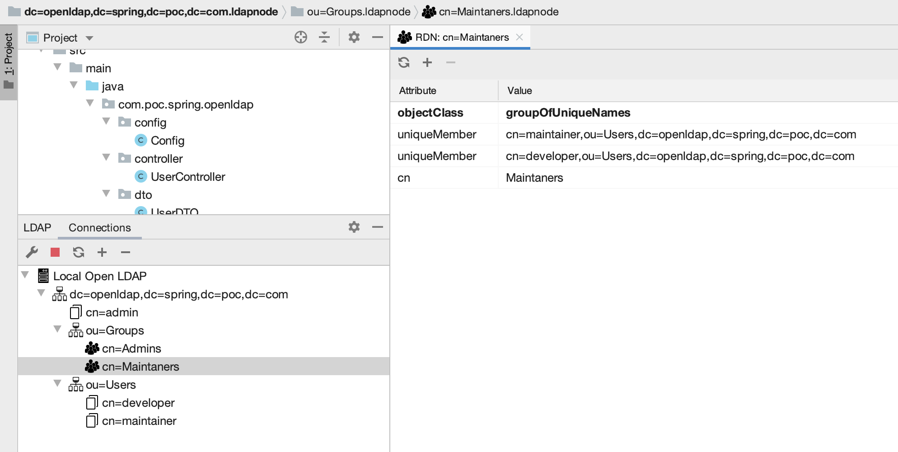

### Spring + LDAP

This project demonstrates the way the Spring application can pull data out of OpenLDAP (or Active Directory) server.

### 1. Create an environment
```
docker-compose up -d
```

### Import data to OpenLDAP server

```
docker cp ./users.ldif poc-spring-openldap_open-ldap_1:/users.ldif
docker exec poc-spring-openldap_open-ldap_1 ldapadd -x -H ldap://localhost -D "cn=admin,dc=openldap,dc=spring,dc=poc,dc=com" -f /users.ldif -w admin
docker exec poc-spring-openldap_open-ldap_1 ldapsearch -x -H ldap://localhost -b dc=openldap,dc=spring,dc=poc,dc=com -D "cn=admin,dc=openldap,dc=spring,dc=poc,dc=com" -w admin
```

If we connect to the OpenLDAP server we must get following structure and data:


### Test

There are 2 endpoints available to test our application. 
Once the ap is started you can call:
```
http://localhost:8080/openldap/authenticate - to authenticate the user in OpenLDAP
http://localhost:8080/openldap/groups - to get user related groups
``` 

### Delete an environment
```
docker-compose down
```